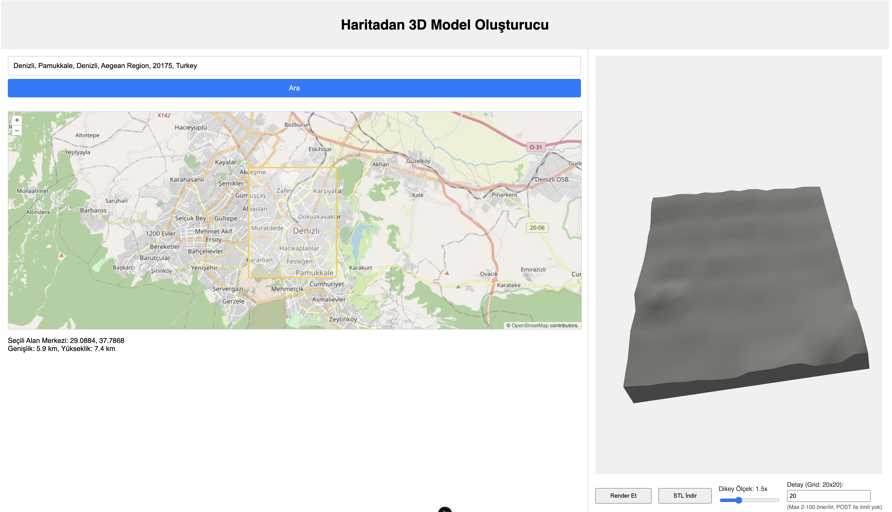

# TerraSTL: Generate 3D Terrain Models from Maps, Locally 🗺️⛰️🖨️

**Bring the world into your hands, one STL at a time.**

TerraSTL is an open-source web tool built with Nuxt.js that allows you to select any region on a map and export its terrain as an STL file — ready for 3D printing. It serves as a powerful, local alternative for generating the topographic models central to projects like my [GeoMagnet project](https://github.com/aligundogdu/geomagnet-project).

While [map2stl.com](https://www.map2stl.com/) is a fantastic service, I embarked on TerraSTL as a personal challenge: to understand the underlying process and recreate the functionality locally, giving more control and insight into how those beautiful terrain models are generated from geographical data.

---

## ✨ Why TerraSTL?

Building upon the spirit of the [GeoMagnet project](https://github.com/aligundogdu/geomagnet-project) – turning memorable locations into tangible 3D prints – TerraSTL provides the **engine** to create the core component: the terrain STL file.

- **Local Control:** Generate STL files on your own machine without relying on external online services.
- **Understanding the Process:** Dive into how map data and elevation models are transformed into 3D geometry.
- **Customization (Future):** Paves the way for deeper customization options beyond what a typical online tool might offer.
- **Personal Challenge:** Developed as a learning exercise in full-stack web development and 3D geometry generation.

---

## 🚀 Features

- Interactive map interface to select your desired region.
- Fetches real-world elevation data for the selected area.
- Generates a 3D terrain model (STL file) based on the data.
- Local operation via a web browser.

---

## 🔧 How it Works (Under the Hood)

TerraSTL is a Nuxt.js application leveraging its full-stack capabilities:

1.  **Frontend (Vue.js / Nuxt):** Displays the interactive map (likely using a library like Leaflet or Mapbox with OpenStreetMap data) and provides the interface for the user to select a geographical bounding box. It also uses **Three.js** to potentially visualize the generated terrain mesh in the browser before export.
2.  **Backend (Nuxt Server Routes):** Acts as an intermediary. Browser-based requests to external APIs like [OpenTopoData](https://www.opentopodata.org/) can sometimes be problematic due to CORS or rate limits when coming directly from a client. The Nuxt backend makes the necessary API calls to fetch elevation data for the selected region.
3.  **Data Processing & STL Generation:** The backend receives the elevation data. This data (essentially a grid of height values) is then processed to construct a 3D mesh. This mesh is finally formatted and exported as an STL file, which is then sent back to the frontend for download.

The use of Nuxt's server routes was essential to reliably fetch data from APIs like OpenTopoData which power the elevation lookups.

---



## 📦 Getting Started

To get TerraSTL up and running on your local machine:

**Prerequisites:**

* Node.js (v14 or higher recommended)
* npm or yarn package manager

**Installation Steps:**

1.  **Clone the repository:**
    ```bash
    git clone [https://github.com/aligundogdu/TerraStl.git](https://github.com/aligundogdu/TerraStl.git)
    cd TerraStl
    ```

2.  **Install dependencies:**
    ```bash
    npm install
    # or
    yarn install
    ```

3.  **Run the development server:**
    ```bash
    npm run dev
    # or
    yarn dev
    ```

The application should now be running at `http://localhost:3000/` (or another port if 3000 is in use). Open this URL in your web browser.

**Building for Production:**

To build the application for production and serve it:

```bash
npm run build
npm run start
# or
yarn build
yarn start
```

## 📦 Getting Started

1. Open the application in your browser (http://localhost:3000/).
2. Use the interactive map to navigate to your desired location.
3. Select the specific area you want to turn into a 3D model (details on selection method - e.g., drawing a box - should be added here based on UI).
4. Click the "Generate STL" or similar button.
5. The STL file will be processed and downloaded to your computer.
6. You can now use this STL file for 3D printing (e.g., as part of your GeoMagnet collection!).

## 🛠️ Tech Stack

- Framework: Nuxt.js (Vue.js)
- 3D Rendering: Three.js
- Mapping: (Specify the map library used, e.g., Leaflet, Mapbox GL JS)
- Backend API Calls: Nuxt Server Routes
- Elevation Data: OpenTopoData API
- Map Data: [OpenStreetMap](https://www.openstreetmap.org/ - acknowledge ODbL)

## ✨ The Challenge & Learning Process
This project was born from a personal challenge to recreate complex functionality and deepen my understanding of turning geographical data into 3D models. It also holds a special place as my first significant application developed with the assistance of cursor-based development tools. This experience has been a fascinating journey into exploring new ways of coding and problem-solving, augmenting traditional development workflows.


## 📚 Coming Soon / Potential Future Enhancements

- User interface options for controlling model scale, vertical exaggeration, base height, and water level (similar to map2stl.com settings).
- More sophisticated mesh generation and optimization.
- Integration with the GeoMagnet frame concept (perhaps generating the frame alongside the terrain).
- Support for other data sources or output formats.

## 🤝 Contributing
Contributions are welcome! Whether you want to report a bug, suggest a feature, or submit a pull request, please feel free to contribute to the project's growth.   

1. Fork the repository.
2. Create your feature branch (git checkout -b feature/YourFeature).
3. Commit your changes (git commit -m 'Add some feature'). 4. Push to the branch (git push origin feature/YourFeature).   
4. Open a Pull Request.

🙏 Acknowledgements
- OpenTopoData (www.opentopodata.org) for providing the essential elevation data API.
- OpenStreetMap (www.openstreetmap.org) for the underlying map data (© OpenStreetMap contributors).
- Three.js (threejs.org) for the powerful 3D rendering capabilities.
- The Nuxt.js community for the fantastic framework.
- To the AI assistant that aided in the development process, demonstrating new ways to build.

## 📄 License
This project is licensed under the MIT License - see the https://www.google.com/search?q=LICENSE file for details.

> "Understanding the journey is as important as reaching the destination. Building the tool reveals the map."

Namaste. 